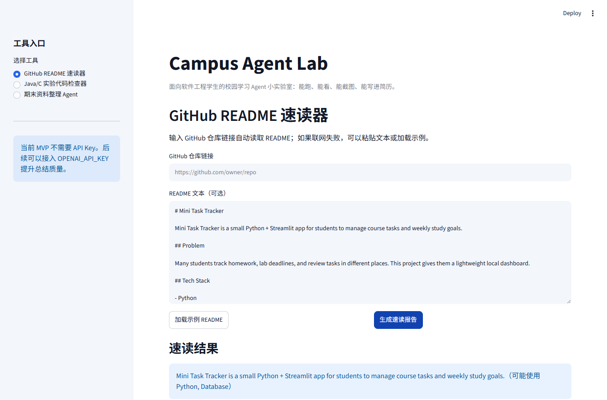
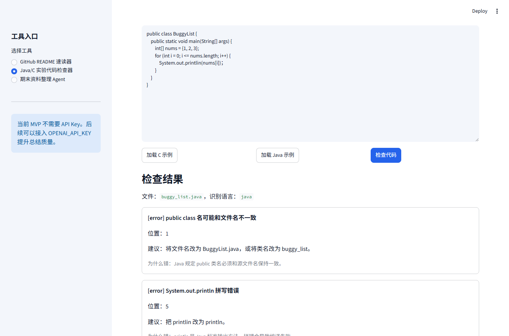
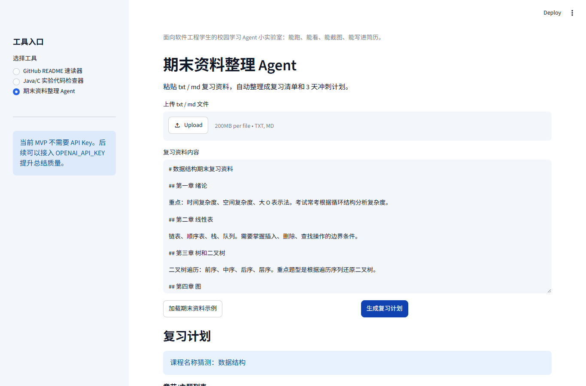

# Campus Agent Lab

Campus Agent Lab 是一个面向软件工程学生的校园学习 Agent 小实验室。当前版本先做 3 个最小可运行工具：

1. GitHub README 速读器
2. Java/C 实验代码检查器
3. 期末资料整理 Agent

项目目标不是做复杂平台，而是先做一个能本地运行、能截图演示、能写进简历的 MVP。

## 为什么做这个项目

软件工程学生经常遇到三类高频场景：

- 看 GitHub 项目时，不知道如何快速判断项目定位、技术栈和学习价值。
- 写 Java/C 实验代码时，常见错误其实可以先用规则和编译检查发现。
- 期末复习资料很多，但缺少一个能快速整理重点和计划的小工具。

Campus Agent Lab 用 Python + Streamlit 把这三件事做成一个本地小工具箱。即使没有 `OPENAI_API_KEY`，也能用规则和模板完成基础分析；未来可以接入 LLM 提升总结质量。

## 功能说明

### 1. GitHub README 速读器

输入 GitHub 仓库链接，例如：

```text
https://github.com/owner/repo
```

工具会尝试读取 README，并输出：

- 项目一句话总结
- 项目解决的问题
- 主要技术栈
- 安装/运行方式
- 核心目录/文件线索
- 适合学生学习的点
- 适合新手贡献的方向
- 风险提示

如果联网失败，可以手动粘贴 README，或使用 `samples/sample_readme.md`。

### 2. Java/C 实验代码检查器

支持上传或粘贴 `.c` / `.java` 代码。工具只做静态检查和编译检查，不运行用户代码。

C 语言检查包括：

- 是否包含 `main`
- `main` 是否可能缺少 `return`
- 是否使用 `gets`
- `malloc` 后是否可能未判断
- 是否出现简单数组越界风险
- 如果本机安装了 `gcc`，执行 compile-only 检查

Java 检查包括：

- 是否存在 `public class`
- public class 名是否可能和文件名不一致
- 是否存在 `main`
- 是否有 `System.out.printlin` 等常见拼写错误
- 是否有中文分号、中文括号等
- 如果本机安装了 `javac`，执行 compile-only 检查

### 3. 期末资料整理 Agent

支持粘贴或上传 txt / md 复习资料，输出：

- 课程名称猜测
- 章节/主题列表
- 高频关键词
- 可能的考试重点
- 待背诵 / 待刷题 / 待整理任务
- 3 天冲刺复习计划
- 可导出的 Markdown 报告

当前规则覆盖：高等数学、数据结构、大学英语、计算机组成原理、中国近现代史纲要。

## 技术栈

- Python 3.11+
- Streamlit
- requests
- pathlib / tempfile / subprocess
- pytest

许可证：MIT License

说明：PDF 解析可以作为增强功能加入，例如使用 `pypdf`。当前 MVP 先稳定支持 txt / md 和直接粘贴文本。

## 本地运行方式

建议使用 Windows + VS Code + Python 3.11+。

方式一：双击运行

```text
run_app.bat
```

方式二：命令行运行

```bash
cd campus-agent-lab
python -m venv .venv
.venv\Scripts\activate
pip install -r requirements.txt
streamlit run app.py
```

浏览器打开 Streamlit 给出的本地地址，通常是：

```text
http://localhost:8501
```

## 运行测试

```bash
cd campus-agent-lab
pytest
```

如果本机没有安装 `gcc` 或 `javac`，代码检查器会提示跳过编译检查，静态检查仍然可用。

## 开发与截图生成

如果需要重新生成 README 截图：

```bash
pip install -r requirements-dev.txt
python -m playwright install chromium
python scripts/capture_screenshots.py
```

截图会写入：

```text
docs/screenshots/
```

## 示例数据

项目内置了 4 个示例文件：

- `samples/sample_readme.md`
- `samples/buggy_hello.c`
- `samples/buggy_list.java`
- `samples/final_exam_notes.md`

打开 Web 页面后，每个工具都有示例按钮，可以直接加载示例并运行。

## 报告导出

每个工具都支持导出 Markdown 报告。点击页面中的保存按钮后，报告会写入 `outputs/` 目录，例如：

```text
outputs/readme_report_20260620_120000.md
outputs/code_check_report_20260620_120000.md
outputs/exam_review_report_20260620_120000.md
```

## Demo Screenshots

### GitHub README 速读器



### Java/C 实验代码检查器



### 期末资料整理 Agent



建议截图方式：

1. 运行 `run_app.bat` 或 `streamlit run app.py`。
2. 分别打开侧边栏的三个工具。
3. 点击示例按钮并运行。
4. 截取每个结果页，放入 `docs/screenshots/` 目录。

演示讲稿见：

```text
docs/demo_script.md
```

## 简历写法示例

```md
Campus Agent Lab：基于 Python + Streamlit 构建校园学习 Agent 工具箱，实现 GitHub README 自动速读、Java/C 实验代码静态检查、期末资料自动整理与 Markdown 报告导出，支持本地运行和后续 LLM 扩展。
```

也可以写成项目经历：

```md
- 使用 Python + Streamlit 独立开发校园学习 Agent MVP，封装 README 分析、代码检查、复习计划生成等核心模块。
- 设计无 API Key 可运行的规则引擎，并预留后续 OpenAI API 扩展接口，提升项目可演示性和迭代空间。
- 通过 pytest 覆盖 URL 解析、代码静态检查、课程识别等关键逻辑，支持 Markdown 报告导出。
```

## 后续 Roadmap

- 接入 OpenAI API 做更自然的总结
- 支持 PDF / Word / PPT 解析
- 支持 GitHub issue 自动分析
- 支持代码风格评分
- 支持学习计划日历化

## 安全边界

- Java/C 检查器不会运行用户提交的程序。
- 编译检查使用临时目录，检查完成后自动清理。
- 当前版本不需要数据库、登录系统或复杂后端。
